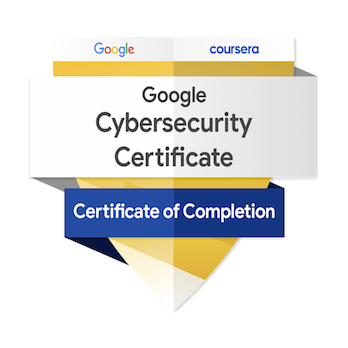

# Sean McCallum – Cybersecurity Career Transition

🇨🇦 Sarnia, Ontario | Remote-ready

Sales leader with 20+ years pivoting into **cybersecurity & cloud security**.  
From turning conversations into closed deals to protecting data and people from threats.

### Certifications & Achievements

 

**Google Cybersecurity Professional Certificate (v.2)**  
Issued by Google via Coursera · [Verify on Credly](https://www.credly.com/badges/43891bc1-0ec5-4e14-87e9-6e2d64ab42fd/public_url)  
Completed: February 2026 · Hands-on skills in Python, Linux, SQL, SIEM tools (e.g., Chronicle, Splunk), incident response, network security, risk management, and more.

**Next up:**  
- CompTIA Security+ (SY0-701) – In progress / Prepping for exam  
- AWS cloud security certifications (e.g., AWS Certified Security – Specialty path)

### Current Focus (2025–2026)

- Completed Google cert labs & projects → Building portfolio  
- Hands-on practice: TryHackMe rooms, Qwiklabs, home SIEM builds (detection rules, vulnerability scans)  
- Python scripting for security tasks (log parsing, basic alerts)

### Strengths I’m Bringing to the Blue Team

- Strong verbal & written communication – Explaining complex ideas simply (from mortgage rates to ransomware risks)  
- Customer-focused problem solving – Reading situations/people fast, finding win-wins under pressure  
- Self-directed learning & time management – Balancing full-time job, family, and 10–15 hrs/week study (post-bedtime grind)

### Core Values That Drive Me

- Protecting people and the businesses they depend on  
- Integrity first – Doing the right thing, even when unseen (sales trust → security ethics)

What excites me: Real people lose sleep over data/privacy threats. I've kept customers safe from bad buys for two decades. Now leveling up to stop bad actors.

**Open to junior/entry-level remote roles** in SOC Analyst, Cybersecurity Analyst, InfoSec, cloud security, or security operations.

Feel free to reach out:
- Email: mccallumsean42@gmail.com (for job inquiries, questions, or chats about cyber transitions)
- Or mention me here (@mccallum-sean) in a comment/issue on my repos

Happy to connect and share more about my journey!
